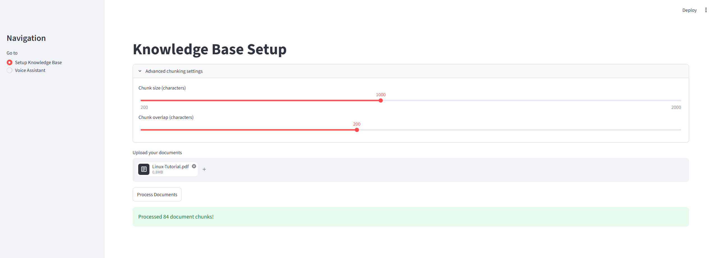
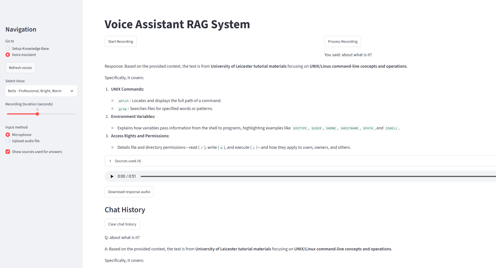
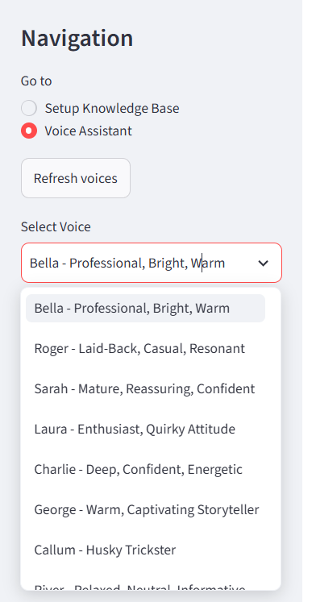

#  Voice RAG Assistant

Ein lokaler, sprachgesteuerter RAG-Chatbot (Retrieval-Augmented Generation):
Dokumente hochladen, per Mikrofon eine Frage stellen, eine **gesprochene**
Antwort erhalten – fundiert auf den eigenen, hochgeladenen Dokumenten statt
nur auf dem allgemeinen Trainingswissen des Sprachmodells.

Gebaut mit **Streamlit** (UI), **LangChain** (RAG-Pipeline), **Google Gemini**
(Sprachgenerierung), **Ollama** (lokale Embeddings), **OpenAI Whisper**
(Speech-to-Text), **ElevenLabs** (Text-to-Speech) und **Chroma**
(Vektordatenbank).

---

## So funktioniert es

### 1. Wissensdatenbank einrichten

Dokumente hochladen (PDF, TXT, MD) – Chunk-Größe und Overlap lassen sich bei
Bedarf direkt in der Oberfläche anpassen.



### 2. Frage stellen und Antwort erhalten

Per Mikrofon (oder Datei-Upload) eine Frage stellen – die Antwort wird
transkribiert, per RAG beantwortet, **inklusive Angabe der genutzten
Quellen**, als Audio ausgegeben und in einer persistenten Chat-Historie
gespeichert.



### 3. Stimme auswählen

Die verfügbaren Stimmen werden **live aus dem eigenen ElevenLabs-Account**
geladen, statt aus einer fest im Code hinterlegten Liste – dadurch werden
immer nur tatsächlich nutzbare Stimmen angezeigt.



---

## Herkunft

Die Grundarchitektur (Dokumente laden → in Chunks zerlegen → in einer
Chroma-Vektordatenbank speichern → `ConversationalRetrievalChain` →
Whisper-Transkription → ElevenLabs-Sprachausgabe) stammt aus einem
Udemy-Kursbeispiel. Ich habe es genutzt, um die komplette RAG-Pipeline
Schritt für Schritt zu verstehen, und anschließend um die unten
beschriebenen eigenen Funktionen und Fehlerbehebungen erweitert.

## Eigene Erweiterungen

<details>
<summary><strong>Neue Funktionen</strong> (zum Aufklappen)</summary>

- **Quellenanzeige** ("Sources used"): Zeigt zu jeder Antwort, aus welchem
  Dokument-Chunk sie tatsächlich stammt – macht nachvollziehbar, ob eine
  Antwort wirklich auf den eigenen Dokumenten beruht.
- **Persistente Chat-Historie** als `chat_history.json`, übersteht auch
  einen App-Neustart, inklusive Lösch-Funktion.
- **Automatisches Laden** einer bereits gespeicherten Wissensdatenbank beim
  Öffnen der Voice-Assistant-Seite, ohne erneutes Hochladen.
- **Audio-Datei-Upload** als Alternative zur Live-Mikrofonaufnahme.
- **Konfigurierbares Chunking** über Schieberegler in der UI, inklusive
  erweiterter Trennzeichen-Kette (Absatz → Zeile → Satz → Wort).
- **Dynamische Stimmenliste**: Stimmen werden live aus dem ElevenLabs-Account
  geladen (inkl. "Refresh voices"-Button), statt hartcodiert zu sein.
- **"Clear Knowledge Base"**, um die gespeicherte Vektordatenbank gezielt
  zurückzusetzen.
- **Download-Button** für die generierte Sprachantwort.
- **Zentrales Logging** (Datei + Konsole) statt verstreuter `print()`-Aufrufe.

</details>

---

## Setup

1. [Ollama](https://ollama.com) installieren und das Embedding-Modell laden:
   ```bash
   ollama pull nomic-embed-text
   ```
2. `.env`-Datei im Projektordner anlegen:
   ```
   ELEVEN_LABS_API_KEY=dein_key
   GEMINI_API_KEY=dein_key
   ```
3. Abhängigkeiten installieren und App starten:
   ```bash
   pip install -r requirements.txt
   streamlit run voice_rag_assistant.py
   ```

## Bedienung

1. Auf **"Setup Knowledge Base"** Dokumente hochladen und auf
   "Process Documents" klicken.
2. Zu **"Voice Assistant"** wechseln, Stimme und Aufnahmedauer wählen.
3. Per Mikrofon aufnehmen (oder Audiodatei hochladen), auf
   "Process Recording" klicken – Frage wird transkribiert, per RAG
   beantwortet und als Sprache ausgegeben.

